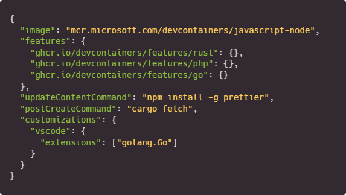

---
# https://vitepress.dev/reference/default-theme-home-page
layout: home

hero:
  name: "Development containers"
  tagline:
    An open specification for enriching containers with development specific
    content and settings
  actions:
    - theme: brand
      text: Get Started
      link: /getting-started
    - theme: alt
      text: Specification
      link: /spec/

features:
  - icon: ⚙️
    title: <a href="/overview">Overview</a>
    details:
      Learn more about how Development Containers work and the specification
  - icon: 📕
    title: <a href="/spec/">Specification</a>
    details: Check the latest updates to the reference implementation
  - icon: 🔀
    title: <a href="/supporting-tools">Supporting tools</a>
    details: Explore other software and services that support this standard!
---

<!-- https://github.com/vuejs/vitepress/issues/800 -->

<HomeContent>

## What are Development Containers?

A Development Container (or Dev Container for short) allows you to use a
container as a full-featured development environment. It can be used to run an
application, to separate tools, libraries, or runtimes needed for working with a
codebase, and to aid in continuous integration and testing. Dev containers can
be run locally or remotely, in a private or public cloud.

The Development Containers Specification seeks to find ways to enrich existing
formats with common development specific settings, tools, and configuration
while still providing a simplified, un-orchestrated single container option – so
that they can be used as coding environments or for continuous integration and
testing. Beyond the specification's core metadata, the spec also enables
developers to quickly share and reuse container setup steps through Dev
Container Features and Templates.

</HomeContent>
